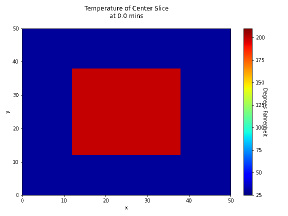

# Cake Cooling Simulator

## Daniel Mortenson, 2022

### Purpose
In the Great British Baking Show, contestants often do not leave enough time for their cakes to cool before frosting them, which leads to messy melted frosting. In this project, I analyze the thermodynamics involved in cooling a cake in a freezer vs. in the open air. The general idea is this: if a cake is placed in a freezer immediately after leaving the oven, that cake will warm up the freezer despite the cooling capacity of the freezer (assuming that the freezer isn't incredibly powerful). This means that there could be a period of time where the inside of the freezer is warmer than the ambient temperature outside of the freezer due to the cake. Instead of placing the cake in the freezer immediately after the baking is done, the baker can leave the cake to cool in the open air for a few minutes.

### Summary of results
The optimal way to cool a cake is to let it cool in the open air for a period of time before placing it inside a refrigerator or freezer. The amount of cooling done in the first few minutes is not very different between the open air and a refrigerator, so there is no advantage to placing the cake in the freezer from the start. Contestants on the Great British Baking Show ought to wait at least 2-4 minutes with their cakes in the open air before placing them in their freezers.
